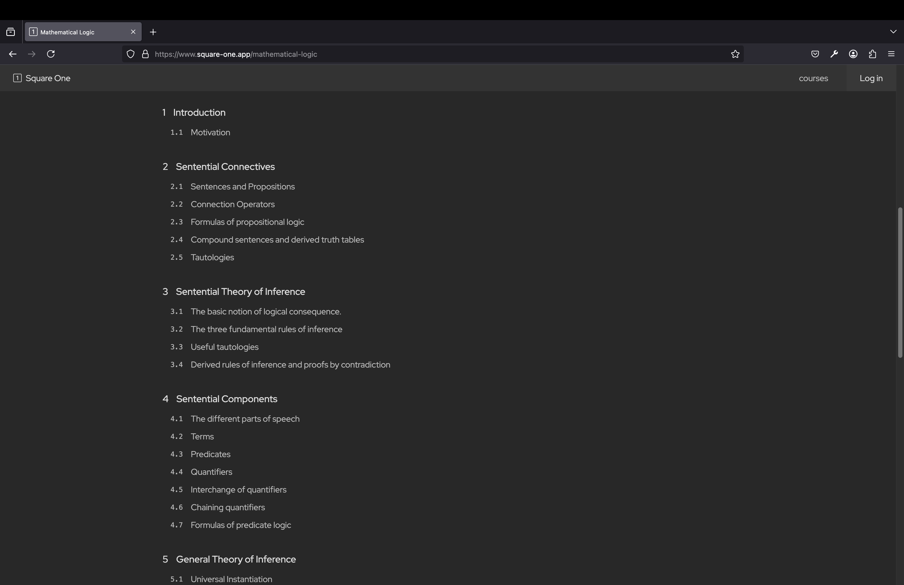

# Square 1

Freely available for consumption at https://square-one.app/.

Square 1 is an online content platform that aims to publish high-quality undergraduate-level mathematics courses.

The distinguishing feature of Square 1 is its integrated reference stack, which allows the reader to
view a referenced definition, theorem, image, or other resource from earlier parts of the text directly next to the current location in the text
without the need to scroll, which usually causes time losses and also an annoying loss of orientation - a feeling of having to piece together ideas that are spread all over the text.

This feature allows Square 1 texts to be absolutely dedicated to the ideals of thoroughness and completeness, all while maintining a concise style.

The reader is also able to take notes in LaTeX format - the modern standard for mathematics notation.

## Demo

## First Order Logic Contents

## Note-taking Panel

## Reference Stack

